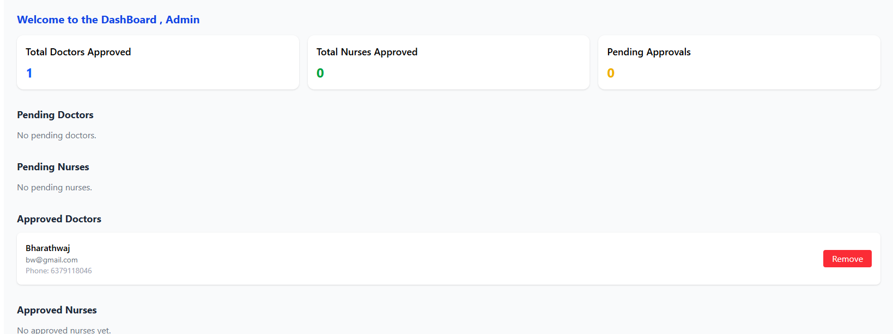
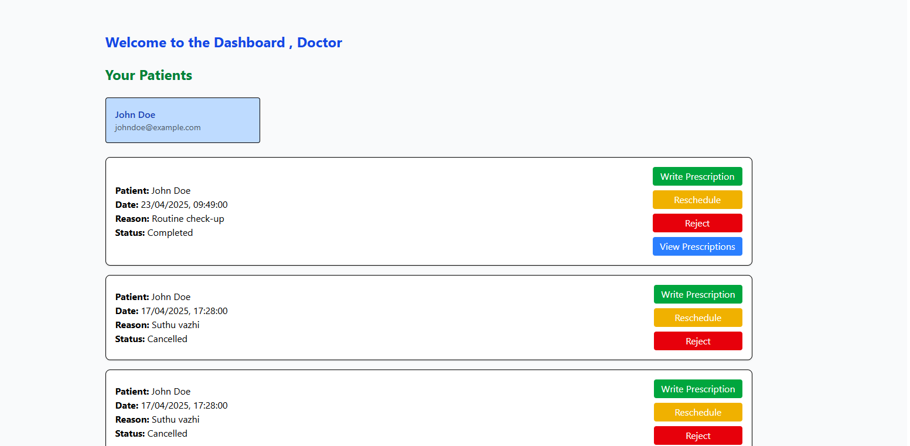
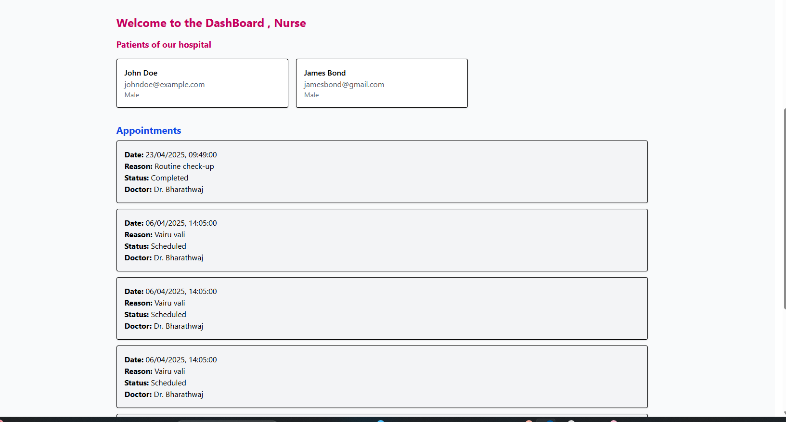
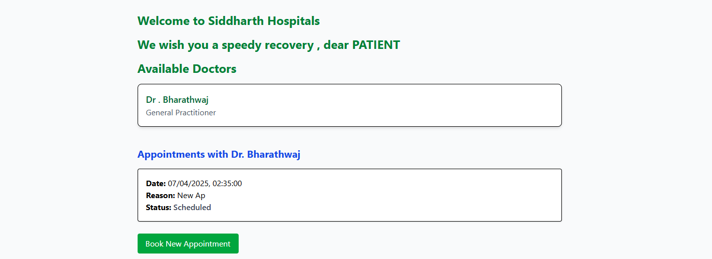

# Hospital Managment System

I have referred this Open source repo for backend of this , and made some changes according to my requirements .

https://github.com/chapi1234/Hospital-Management-System-Backend-API

My forked version:
https://github.com/isid555/Hospital-Management-System-Backend-API

Frontend Deplyed Link :
https://hospital-managment-frontend-delta.vercel.app/

# Introduction

The Hospital Management System is a web application designed to manage the operations of a hospital. It allows administrators, doctors, nurses, and patients to interact with the system to manage appointments, profiles, and other related tasks.

# Features

🔑 User Authentication: Secure login and registration for users.
🔄 Role-Based Access Control: Different functionalities for admin, doctor, nurse, and patient roles.
🧑‍⚕️ Profile Management: Users can view and update their profiles.
📅 Appointment Management: Patients can book appointments, and doctors can manage their appointments.
💊 Prescription Management: Doctors can create and manage prescriptions for patients.
📊 Admin Dashboard: Admins can manage users, doctors, and nurses.

# 4 Roles 
1. Admin
2. Doctor
3. Nurses
4. Patients 

# 1.Admins

Admin has authority to accept or decline an approval to become a doctor or nurse in this organisation
Admin can also remove the user(doctor,nurses) if they resign the JOB !!!

# 2.Doctors

Doctors , have access only to the patients they are consulting / about to consult . Patient request for an appoinment to the doctor , then doctor will either reject or reschedule the appoinment . 
If consultation is happening , the doctor can write prescription and complete the consultation.

# 3. Nurses 

Nurses can view all the patients of the hospital and get informed about the appoinments .

# 4. Patients

Patients can see all the approved Doctors in the hospital , request for an appoinment to their wish .Once consulted they can view their prescription in their  patient dashboard .